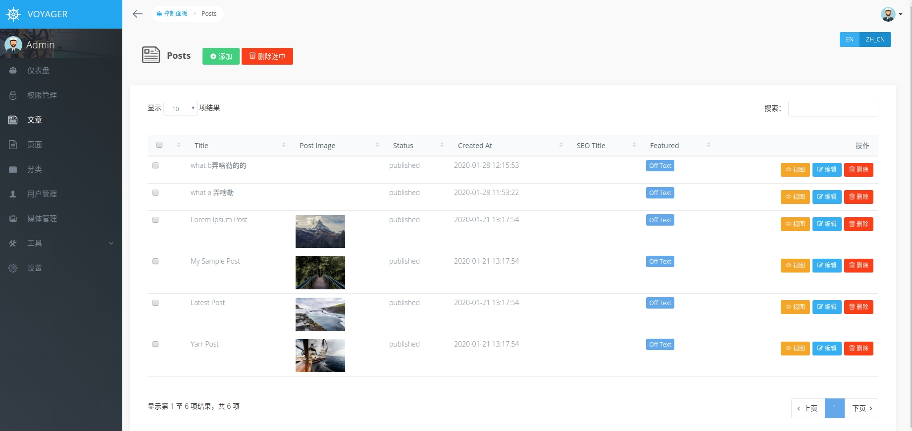

# voyager spanish lang plugin

Voyager Spanish  

## Requirement

1. PHP >= 7.2
2. Laravel >= 5.5
3. [**Voyager**](http://doc.laravel-voyager.cn/)

## Install hook

```bash
php artisan hook:install spanish-lang
```

## Enable hook

```bash
php artisan hook:enable spanish-lang
```

## Notice

Durante el período de activación de este gancho,
No modifique el nombre del grupo de menú `admin-es_MX` y no elimine este grupo de menú 

## Priview

